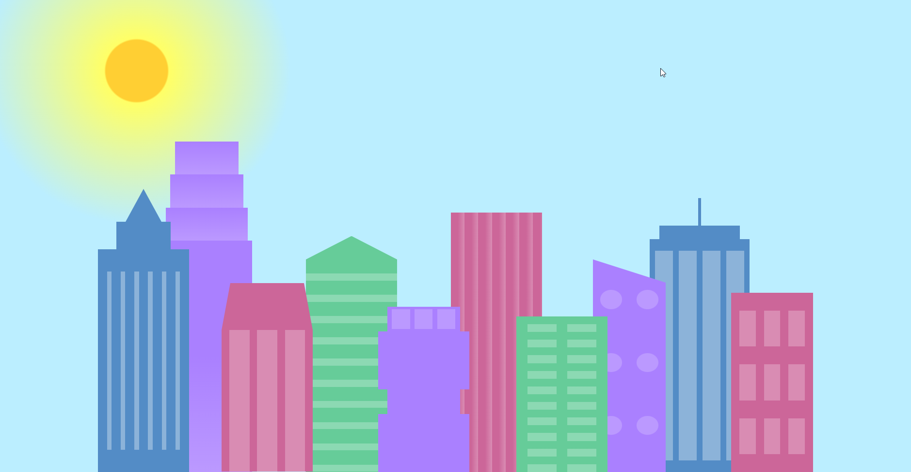
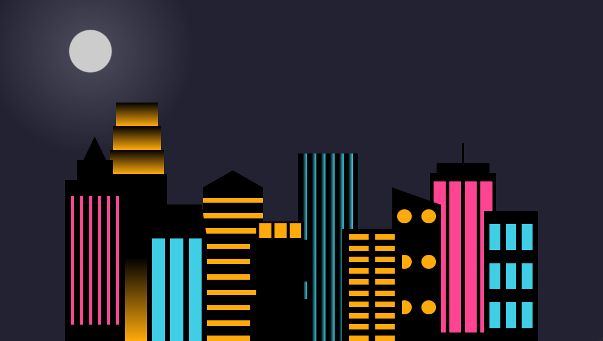

# cssity
Esse projeto foi feito para desafiar meu conhecimento com css e eu estou muito orgulhoso do resutado  
Esse projeto também conta com uma média query que transforma a cidade quando a janela é pequena suficiente

<h2>Essa é a cidade quando a tela é grande suficiente para ser dia</h2>

<h2>E essa é a cidade quando a tela esta abaixo de 1000px</h2>

## Desafios do projeto
Durante o projeto eu tive que aprender algumas coisas novas como por exemplo o uso de variáveis, que  acabou sendo bem difícil inicialmente pois eu não conseguia usar as variáveis que eu criava, tudo se resolveu quando eu movi todas as varíáveis para o :root.
